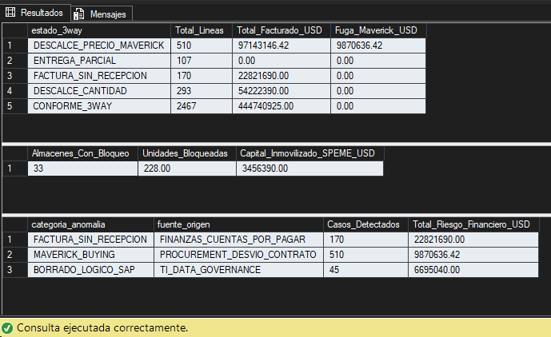
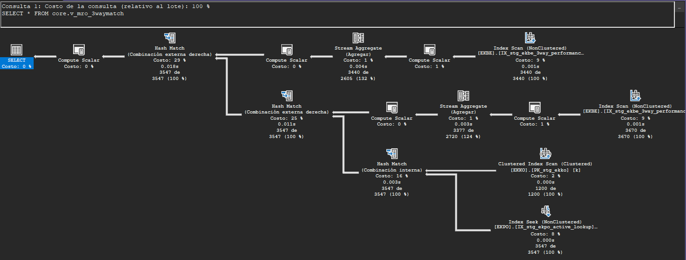

# Mining MRO Analytics Engine ⛏️📊
### Backend Forense T-SQL para Auditoría Transaccional SAP MM y Contratos Mineros MARC

[](#)
[](#)
[-007DB8?logo=sap)](#)
[](#)

---

## 1. Resumen Ejecutivo & Impacto Financiero

En operaciones de gran minería (equipos pesados CAEX y palas electromecánicas), la gestión de repuestos MRO (*Maintenance, Repair, and Operations*) representa uno de los mayores centros de costo y riesgo operativo.

Este motor analítico implementa un backend relacional en **T-SQL nativo** para ejecutar auditoría forense y control de **3-Way Match** entre órdenes de compra, recepciones físicas de bodega e imputaciones de facturas.

### Hallazgos Forenses Cuantificados (Dataset Operacional 1 Mes):
* **USD 9.870.636,42 en Fuga Financiera (Maverick Buying):** Detectados en 510 líneas de pedido donde el precio facturado unitario excedió la tarifa contractual negociada en el contrato marco (*Master Agreement / MARC*).
* **USD 3.456.390,00 en Capital Inmovilizado (SPEME):** Componentes críticos retenidos bajo bloqueo de inspección de calidad en 33 almacenes de faena, restringiendo la disponibilidad operativa.
* **USD 22.821.690,00 en Facturación sin Entrada de Mercancía:** 170 documentos de factura procesados contablemente sin recepción física validada (MIGO ausente).
* **USD 6.695.040,00 en Posiciones Anuladas Descartadas:** 45 registros de compras canceladas en ERP (`loekz = 'X'`) aislados para prevenir duplicidad en compromisos presupuestarios.

<p align="center">
  
</p>
---

## 2. Arquitectura de Datos por Capas

El motor implementa una estricta segregación de responsabilidades mediante esquemas relacionales desacoplados:

```text
MiningMRO_Engine/
├── SQL/
│   ├── 00_init/               --> Creación de base de datos y esquemas lógicos defensivos
│   ├── 01_ddl_tables/         --> DDL tipado según diccionario SAP MM con PKs explícitas
│   ├── 02_ingestion/          --> Carga volumétrica masiva y scripts de verificación
│   ├── 03_views/              --> Neteo transaccional MIGO/MIRO y matriz de anomalías
│   ├── 04_stored_procedures/  --> Procedimientos transaccionales ACID con bloques TRY...CATCH
│   └── 05_indexes/            --> Índices Non-Clustered y Covering Indexes para planes de ejecución
└── README.md
```

|**Capa / Esquema**|**Propósito Operacional**|**Objetos Principales**|
|---|---|---|
|**`stg`**|Staging e ingesta cruda desde tablas del ERP.|`EKKO` (Cabeceras), `EKPO` (Posiciones), `EKBE` (Movimientos), `MARD` (Saldos)|
|**`core`**|Lógica de negocio, neteo transaccional y consumo BI.|`v_mro_3waymatch`, `v_sap_mm_mro_forensic`, `v_mro_calidad_datos_anomalias`|
|**`audit`**|Persistencia histórica, gobernanza y excepciones.|`tb_log_anomalias_mro`, `sp_insert_mro_audit_log`|

## 3. Lógica Transaccional de Negocio

### Neteo de Almacén SAP MM
Para evitar falsos positivos por reversas operacionales en faena, el cálculo agrega los flujos contables utilizando el código contable de balanceo (`shkzg`):
* **Entradas de Mercancía (`vgabe = 1`):** Ingreso físico (`101` / Débito `S`) neteado contra anulaciones o devoluciones (`102` / Crédito `H`).
* **Recepción de Facturas (`vgabe = 2`):** Facturas registradas en finanzas (`MIRO` / Débito `S`) neteadas contra notas de crédito (`H`).

### Detección de Sobreprecio (Maverick Buying)
Las desviaciones de precios en adquisiciones se calculan de acuerdo a las siguientes reglas contables:

* **Desvío Unitario:**  
  `Desvío Unitario = (wrbtr / menge) [en MIRO] - netpr [en EKPO]`

* **Fuga Maverick (USD):**  
  `Fuga Maverick (USD) = MAX(0, Desvío Unitario * menge [en MIRO])`

---

## 4. Estrategia de Indexación y Rendimiento

El backend está optimizado para garantizar tiempos de respuesta sub-segundo preparados para **DirectQuery** y **Query Folding** en Power BI.

* **`IX_stg_ekbe_3way_performance`:**  
  Índice compuesto sobre `(ebeln, ebelp, vgabe)` con cláusula `INCLUDE (menge, wrbtr, shkzg)` sobre `stg.EKBE`. Cubre en un 100% los predicados de las Common Table Expressions (CTEs), eliminando operadores costosos de tipo *Key Lookup*.

* **`IX_stg_ekpo_active_lookup`:**  
  Índice no agrupado sobre `(loekz, ebeln, ebelp)` con `INCLUDE` sobre especificaciones de repuestos. Permite que el motor resuelva el descarte de registros borrados lógicamente mediante un **Index Seek** de bajo costo (8%).

* **`IX_stg_mard_speme_quality`:**  
  Índice no agrupado sobre `(speme)` con `INCLUDE (matnr, werks, lgort, labst)` sobre `stg.MARD` para aislar instantáneamente el inventario bloqueado en control de calidad.

<p align="center">
  
</p>

---

## 5. Instrucciones de Despliegue

1. Clonar el repositorio localmente: `git clone https://github.com/ObedFermin/MiningMRO_Engine.git`

2. Abrir **SQL Server Management Studio (SSMS)** y conectarse a la instancia de base de datos relacional.

3. Ejecutar los scripts en orden secuencial:
   * `SQL/00_init/01_create_database.sql`
   * `SQL/00_init/02_create_schemas.sql`
   * `SQL/01_ddl_tables/01_tb_stg_ekko.sql` hasta `05_tb_audit_log_anomalias.sql`
   * `SQL/02_ingestion/01_bulk_insert_sap_data.sql`
   * `SQL/03_views/01_v_mro_3waymatch.sql` hasta `03_v_mro_calidad_datos_anomalias.sql`
   * `SQL/04_stored_procedures/01_sp_insert_mro_audit_log.sql`
   * `SQL/05_indexes/01_idx_mro_performance.sql`

4. Certificar la integridad de los resultados ejecutando:
   * `SQL/03_views/04_audit_summary_check.sql`