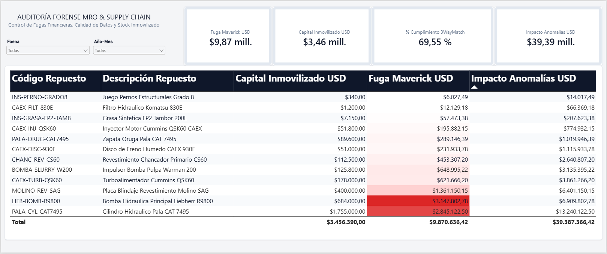
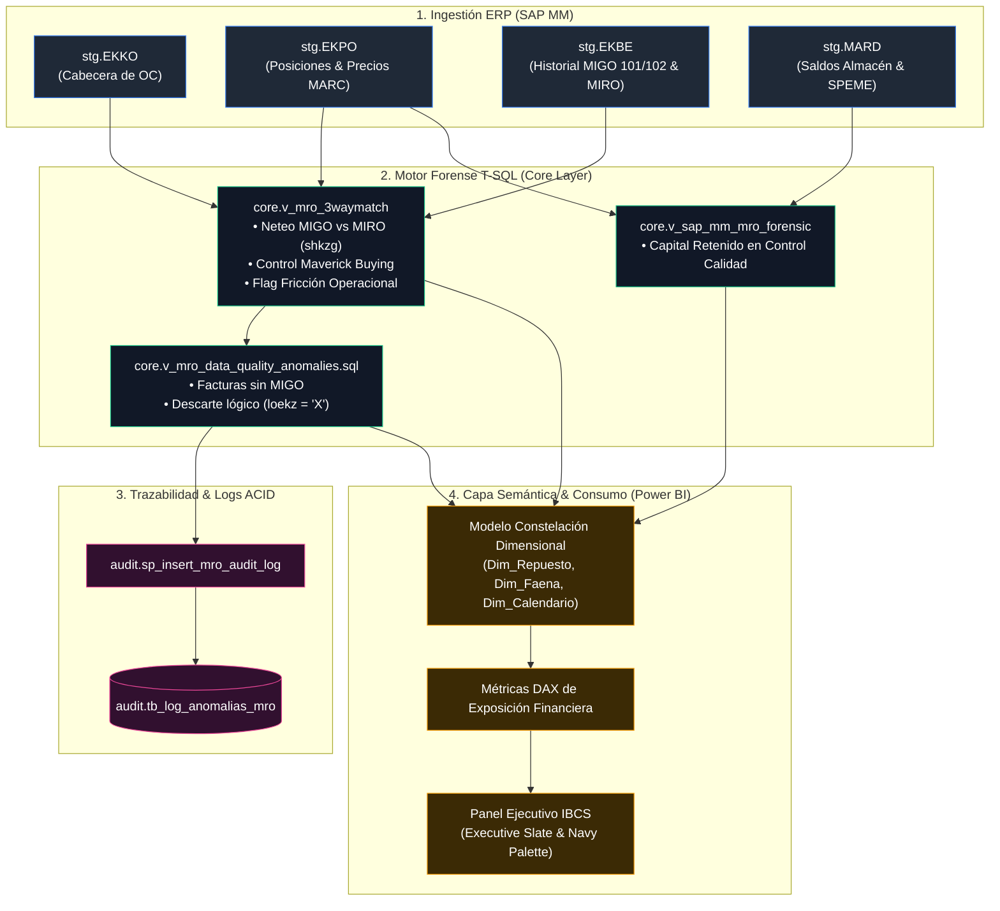

# Mining MRO Analytics Platform ⛏️📊
## Motor Forense Transaccional SAP MM y Reportería Semántica en Business Intelligence IBCS

[](#)
[](#)
[](#)
[-007DB8?logo=sap)](#)
[](#)
[](#)

---

## 1. Resumen Ejecutivo & Impacto Financiero

En las operaciones de minería de rajo abierto y procesamiento de mineral (equipos de extracción CAEX, palas electromecánicas y molienda SAG), el aprovisionamiento MRO (*Maintenance, Repair, and Operations*) concentra riesgos críticos de fuga de caja y desabastecimiento operativo.

Esta plataforma integra un **backend relacional de auditoría forense en T-SQL** conectado a una **capa de visualización ejecutiva en Power BI estandarizada bajo norma IBCS** para el control de *3-Way Match*, precios marco y capital inmovilizado.

<p align="center">
  
</p>

### Hallazgos Forenses Cuantificados (Corte Operacional Consolidado):
* **USD 9,87M en Fuga Financiera Directa (Maverick Spend):** Compras ejecutadas por fuera de los acuerdos corporativos marco (*Master Agreement / MARC*).
* **USD 3,46M en Capital Inmovilizado (SPEME):** Componentes críticos retenidos bajo bloqueo de calidad en pañoles y bodegas operativas, restringiendo el capital de trabajo.
* **69,55% de Cumplimiento 3-Way Match:** Exposición operacional severa donde ~30% de las órdenes de compra presentan descalces entre Órdenes (PO), Recepción física (GR) y Factura (IR).
* **USD 39,39M de Exposición Global por Inconsistencias:** Monto comprometido en transacciones con anomalías de datos, facturas huérfanas o reversas en patio.
* **Concentración de Riesgo (Pareto):** El **74,5%** de toda la fuga económica ($7,35M USD) se concentra en solo 3 componentes: Bomba Hidráulica Liebherr R9800 (`LIEB-BOMB-R9800`), Cilindro Hidráulico Pala CAT 7495 (`PALA-CYL-CAT7495`) y Revestimiento Molino SAG (`MOLINO-REV-SAG`).
  
<p align="center">
  
</p>

---

## 2. Arquitectura de la Solución End-to-End

```text
mro-forensic-analytics/
├── SQL/
│   ├── 00_init/               --> Creación de BD y concurrencia no bloqueante (RCSI)
│   ├── 01_ddl_tables/         --> Tablas staging tipadas según diccionario SAP MM (EKKO, EKPO, EKBE, MARD)
│   ├── 02_ingestion/          --> Carga transaccional masiva y validaciones volumétricas
│   ├── 03_views/              --> Neteo MIGO/MIRO, lógica 3-Way Match y anomalías de datos
│   ├── 04_stored_procedures/  --> Procedimiento transaccional ACID con bloques TRY...CATCH para logging
│   ├── 05_indexes/            --> Índices Non-Clustered y Covering Indexes para acelerar lecturas
│   └── 06_tests/              --> Test Harness fiduciario unitario con fixtures en memoria
├── bi/
│   ├── pbix/                  --> Archivo maestro Power BI (Mro_mining.pbix)
│   └── dax/                   --> Medidas DAX de auditoría documentadas en texto plano
├── docs/
│   ├── SPEC.md                --> Especificación técnica y catálogo de reglas de auditoría
│   └── img/                   --> Evidencias de planes de ejecución y pruebas unitarias
├── reports/
│   ├── Mro_mining.pdf         --> Entregable ejecutivo consolidado de 1 página
│   └── dashboard_preview.png  --> Captura del dashboard en alta resolución
└── README.md
```

### Linaje de Datos: De SAP MM a la Decisión Gerencial



---

## 3. Lógica Transaccional de Negocio (Backend)

### Neteo Transaccional MIGO/MIRO y Detección de Fricción
Para prevenir falsos positivos provocados por devoluciones o reversas de faena en bodega, las CTEs agregan los apuntes contables evaluando la naturaleza Debe/Haber (`shkzg`):
* **Entrada de Mercancías (`vgabe = 1`):** Recepción física (`101` / Cargo `S`) neta contra anulaciones de patio (`102` / Abono `H`).
* **Recepción de Facturas (`vgabe = 2`):** Facturas (`MIRO` / Cargo `S`) netas contra notas de crédito (`H`).
* **Flag de Fricción Operacional:** Si la transacción requirió reversas pero netea a balance cero, se cataloga como `HISTORIAL_CON_REVERSAS` para auditoría de proveedores y almacenes.

### Regla Forense 3-Way Match

El motor clasifica el estado de cada posición evaluando las transacciones bajo la siguiente jerarquía:

```text
SI Cantidad_MIGO = 0 Y Cantidad_MIRO > 0       -> 'FACTURA_SIN_RECEPCION'
SI P.U._MIRO > (P.U._Contrato + 0.01)          -> 'DESCALCE_PRECIO_MAVERICK'
SI Cantidad_MIRO > Cantidad_MIGO               -> 'DESCALCE_CANTIDAD'
SI Cantidad_MIGO < Cantidad_PO Y MIGO > 0     -> 'ENTREGA_PARCIAL'
EN CUALQUIER OTRO CASO                         -> 'CONFORME_3WAY'
```


---

## 4. Modelado Semántico y Métricas DAX (Power BI)

El modelo semántico consume las vistas optimizadas de SQL Server mediante relaciones de 1 a varios unidireccionales:

### 4.1. Fuga Maverick Acumulada (USD)
Calcula el sobrecosto real pagado por encima del contrato marco pactado:
```dax
Fuga Maverick USD = 
SUM(core_v_mro_3waymatch[fuga_maverick_usd])
```

### 4.2. Capital Inmovilizado en Control de Calidad (SPEME)
Valorización del inventario paralizado por inspecciones técnicas al costo promedio de contrato:
```dax
Capital Inmovilizado USD = 
SUM(core_v_sap_mm_mro_forensic[capital_inmovilizado_speme_usd])
```

### 4.3. Tasa de Cumplimiento 3-Way Match (%)
Proporción de transacciones de compra conformes sin desviaciones de precio, cantidad ni recepción:
```dax
% Cumplimiento 3WayMatch = 
DIVIDE(
    CALCULATE(
        COUNTROWS(core_v_mro_3waymatch),
        core_v_mro_3waymatch[estado_3way] = "CONFORME_3WAY"
    ),
    COUNTROWS(core_v_mro_3waymatch),
    0
)
```

### 4.4. Impacto Total por Anomalías (USD)
Exposición consolidada por riesgos de gobierno de datos, borrados lógicos y facturas sin recepción:
```dax
Impacto Anomalias USD = 
SUM(core_v_mro_calidad_datos_anomalias[impacto_financiero_usd])
```

---

### 5. Diseño Ejecutivo & Estándares IBCS

El panel analítico sigue las directrices del International Business Communication Standards (IBCS):

* **Paleta Corporativa Executive Slate & Navy:** Estructurada en base a Azul Marino Oscuro (`#0F172A`) para cabeceras y texto principal, Gris Pizarra (`#64748B`) para etiquetas secundarias y Gris Suave (`#F4F5F7`) para el fondo del lienzo.
* **Uso Semafórico Funcional:** Degradado lineal de 3 puntos aplicado a la columna de Fuga Maverick: neutro en blanco (`#FFFFFF`), advertencia intermedia en rosa suave (`#FECACA`) y alerta crítica en rojo estándar (`#DC2626`), reservando la saturación alta exclusivamente para desvíos presupuestarios severos.
* **Reducción de Ruido Visual:** Tarjetas KPI flotantes con esquinas redondeadas (8 px), sombras suaves y márgenes homogéneos para garantizar legibilidad ejecutiva inmediata.

---

## 6. Rendimiento, Indexación y Pruebas Fiduciarias

* **Aislamiento Snapshot (RCSI):** Base configurada con `READ_COMMITTED_SNAPSHOT ON` para permitir lecturas sin bloqueos de concurrencia durante cargas operativas.
* **Índices de Cobertura (Covering Indexes):**
  * `IX_stg_ekbe_3way_performance`: Elimina *Key Lookups* en las CTEs de agregación MIGO/MIRO sobre `stg.EKBE`.
  * `IX_stg_ekpo_active_lookup`: Permite resolver el filtrado de registros borrados (`loekz`) mediante *Index Seek*.
  * `IX_stg_mard_speme_quality`: Acelera la segmentación del inventario bloqueado en calidad (`speme`).
* **Test Harness Fiduciario:** Suite unitaria en memoria (`06_tests/01_test_harness_3way_fixtures.sql`) con 5 casos de prueba deterministas (Match Conforme, Sobreprecio, Factura Huérfana, Reversa Física y Borrado Lógico) con certificación **100% PASS**.

<p align="center">
  
</p>

---

## 7. Instrucciones de Despliegue Local

1. Clonar el repositorio:
   ```bash
   git clone [https://github.com/ObedFermin/MiningMRO_Engine.git](https://github.com/ObedFermin/MiningMRO_Engine.git)
   ```
2. Ejecutar los scripts SQL en orden secuencial en **SQL Server Management Studio (SSMS)**:
   * `SQL/00_init/01_create_database.sql`
   * `SQL/00_init/02_create_schemas.sql`
   * `SQL/01_ddl_tables/` (tablas `stg` y `audit`)
   * `SQL/02_ingestion/01_bulk_insert_sap_data.sql`
   * `SQL/03_views/` (vistas `core`)
   * `SQL/04_stored_procedures/`
   * `SQL/05_indexes/`
3. Certificar el motor ejecutando `SQL/06_tests/01_test_harness_3way_fixtures.sql`.
4. Abrir el archivo `bi/pbix/Mro_mining.pbix` en Power BI Desktop, actualizar la conexión a la base `Bunker_MRO` de tu instancia local y explorar el reporte interactivo.