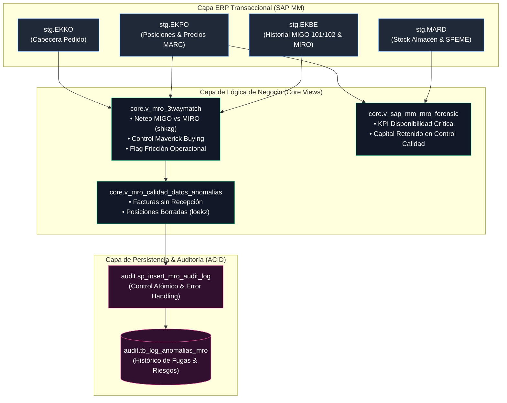
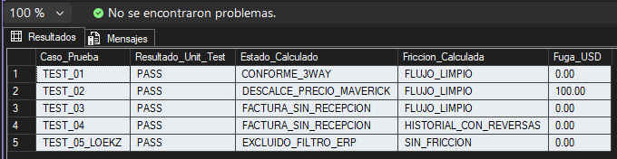

# Mining MRO Analytics Engine ⛏️📊
### Backend Forense T-SQL para Auditoría Transaccional SAP MM y Contratos Mineros MARC

[](#)
[](#)
[-007DB8?logo=sap)](#)
[](#)
[](#)

---

## 1. Resumen Ejecutivo & Impacto Financiero

En las operaciones de la gran minería (equipos pesados CAEX y palas electromecánicas), la gestión de repuestos MRO (*Maintenance, Repair, and Operations*) representa uno de los mayores centros de costo y riesgo operativo.

Este motor analítico implementa un backend relacional en **T-SQL nativo** para ejecutar auditoría forense y control de **3-Way Match** entre órdenes de compra, recepciones físicas de bodega e imputaciones de facturas.

### Hallazgos Forenses Cuantificados (Dataset Operacional 1 Mes):
* **USD 9.870.636,42 en Fuga Financiera (Maverick Buying):** Detectados en 510 líneas de pedido donde el precio facturado unitario excedió la tarifa contractual negociada en el contrato marco (*Master Agreement / MARC*).
* **USD 54.222.390,00 en Líneas con Fricción Operacional:** 293 transacciones identificadas con eventos de anulación en patio/bodega (MIGO `102`) o notas de crédito contables (`shkzg = 'H'`), aislando contratistas y bodegas con reprocesos recurrentes.
* **USD 3.456.390,00 en Capital Inmovilizado (SPEME):** Componentes críticos retenidos bajo bloqueo de inspección de calidad en 33 almacenes de faena, restringiendo la disponibilidad operativa.
* **USD 22.821.690,00 en Facturación sin Entrada de Mercancía:** 170 documentos de factura procesados contablemente sin recepción física validada (MIGO ausente).
* **USD 6.695.040,00 en Posiciones Anuladas Descartadas:** 45 registros de compras canceladas en ERP (`loekz = 'X'`) aislados para prevenir duplicidad en compromisos presupuestarios.

<p align="center">
  
</p>

---

## 2. Arquitectura de Datos por Capas

El motor implementa una estricta segregación de responsabilidades mediante esquemas relacionales desacoplados:

```text
MiningMRO_Engine/
├── SQL/
│   ├── 00_init/               --> Creación de base de datos y aislamiento defensivo (RCSI)
│   ├── 01_ddl_tables/         --> DDL tipado según diccionario SAP MM con PKs explícitas
│   ├── 02_ingestion/          --> Carga volumétrica masiva y scripts de verificación
│   ├── 03_views/              --> Neteo transaccional MIGO/MIRO, Maverick Buying y fricción
│   ├── 04_stored_procedures/  --> Procedimientos transaccionales ACID con bloques TRY...CATCH
│   ├── 05_indexes/            --> Índices Non-Clustered y Covering Indexes para DirectQuery
│   └── 06_tests/              --> Test Harness fiduciario unitario con fixtures aislados
└── README.md
```

| **Capa / Esquema** | **Propósito Operacional**                            | **Objetos Principales**                                                                              |
| ------------------ | ---------------------------------------------------- | ---------------------------------------------------------------------------------------------------- |
| **`stg`**          | Staging e ingesta cruda desde tablas del ERP.        | `EKKO` (Cabeceras), <br>`EKPO` (Posiciones), <br>`EKBE` (Movimientos), <br>`MARD` (Saldos)           |
| **`core`**         | Lógica de negocio, neteo transaccional y consumo BI. | `01_v_mro_3waymatch.sql`, <br>`02_v_sap_mm_mro_forensic.sql`, `03_v_mro_calidad_datos_anomalias.sql` |
| **`audit`**        | Persistencia histórica, gobernanza y excepciones.    | `05_tb_audit_log_anomalias.sql`, `01_sp_insert_mro_audit_log.sql`                                    |
| **`tests`**        | Certificación unitaria fiduciaria automatizada.      | `01_test_harness_3way_fixtures.sql`                                                                  |

### Flujo de Datos y Linaje de Transformación



## 3. Lógica Transaccional de Negocio

### Neteo de Almacén SAP MM y Detección de Fricción

Para evitar falsos positivos por reversas operacionales en faena, el cálculo agrega los flujos contables utilizando el código contable de balanceo (`shkzg`) y cuantifica las desviaciones de proceso:

- **Entradas de Mercancía (`vgabe = 1`):** Ingreso físico (`101` / Débito `S`) neteado contra anulaciones o devoluciones (`102` / Crédito `H`).
    
- **Recepción de Facturas (`vgabe = 2`):** Facturas registradas en finanzas (`MIRO` / Débito `S`) neteadas contra notas de crédito (`H`).
    
- **Indicador de Fricción Operacional:** Conteo explícito de cancelaciones (`bwart = '102'` y `shkzg = 'H'`). Si una línea cuadra en cero pero requirió reversas, se categoriza como `HISTORIAL_CON_REVERSAS` para auditoría de proveedores.
    

### Detección de Sobreprecio (Maverick Buying)

Las desviaciones de precios en adquisiciones se calculan de acuerdo a las siguientes reglas contables:

- **Desvío Unitario:**
    
    `Desvío Unitario = (wrbtr / menge) [en MIRO] - netpr [en EKPO]`
    
- **Fuga Maverick (USD):**
    
    `Fuga Maverick (USD) = MAX(0, Desvío Unitario * menge [en MIRO])`
    

## 4. Estrategia de Indexación y Rendimiento

El backend está optimizado para garantizar tiempos de respuesta sub-segundo preparados para **DirectQuery** y **Query Folding** en Power BI sin requerir permisos de escritura (`CREATE VIEW`).

- **`IX_stg_ekbe_3way_performance`:**
    
    Índice compuesto sobre `(ebeln, ebelp, vgabe)` con cláusula `INCLUDE (menge, wrbtr, shkzg)` sobre `stg.EKBE`. Cubre en un 100% los predicados de las Common Table Expressions (CTEs), eliminando operadores costosos de tipo _Key Lookup_.
    
- **`IX_stg_ekpo_active_lookup`:**
    
    Índice no agrupado sobre `(loekz, ebeln, ebelp)` con `INCLUDE` sobre especificaciones de repuestos. Permite que el motor resuelva el descarte de registros borrados lógicamente mediante un **Index Seek** de bajo costo (8%).
    
- **`IX_stg_mard_speme_quality`:**
    
    Índice no agrupado sobre `(speme)` con `INCLUDE (matnr, werks, lgort, labst)` sobre `stg.MARD` para aislar instantáneamente el inventario bloqueado en control de calidad.
    

<p align="center">
  
</p>
## 5. Suite de Pruebas Unitarias & Test Harness

Para certificar la integridad fiduciaria y la precisión matemática antes del pase a producción o conexión al Front-End, el proyecto incluye un banco de pruebas determinista en memoria (`06_tests/01_test_harness_3way_fixtures.sql`).

El script ejecuta aserciones directas contra 5 escenarios críticos de auditoría:

|**Caso de Prueba**|**Escenario Fiduciario Evaluado**|**Resultado Esperado**|**Certificación Unit Test**|
|---|---|---|---|
|**`TEST_01`**|**Match Conforme (3-Way 100%):** OC = MIGO = MIRO|`CONFORME_3WAY` / Fuga = 0.00|**`PASS`**|
|**`TEST_02`**|**Maverick Buying:** Tarifa facturada ($120) excede contrato ($100)|`DESCALCE_PRECIO_MAVERICK` / Fuga = $100.00|**`PASS`**|
|**`TEST_03`**|**Factura sin Entrada Física:** MIRO ingresada sin MIGO en bodega|`FACTURA_SIN_RECEPCION`|**`PASS`**|
|**`TEST_04`**|**Reversa Física en Bodega:** Ingreso 101 neteado con 102|`HISTORIAL_CON_REVERSAS` / Factura Huérfana|**`PASS`**|
|**`TEST_05_LOEKZ`**|**Integridad de Datos ERP:** Posición borrada lógicamente (`loekz = 'X'`)|Registro completamente excluido del modelo|**`PASS`**|
<p align="center">  </p>

## 6. Instrucciones de Despliegue

1. Clonar el repositorio localmente:
    
    `git clone https://github.com/ObedFermin/MiningMRO_Engine.git`
    
2. Abrir **SQL Server Management Studio (SSMS)** y conectarse a la instancia de base de datos relacional.
    
3. Ejecutar los scripts en orden secuencial:
    
    - `SQL/00_init/01_create_database.sql`
        
    - `SQL/00_init/02_create_schemas.sql`
        
    - `SQL/01_ddl_tables/01_tb_stg_ekko.sql` hasta `05_tb_audit_log_anomalias.sql`
        
    - `SQL/02_ingestion/01_bulk_insert_sap_data.sql`
        
    - `SQL/03_views/01_v_mro_3waymatch.sql` hasta `03_v_mro_calidad_datos_anomalias.sql`
        
    - `SQL/04_stored_procedures/01_sp_insert_mro_audit_log.sql`
        
    - `SQL/05_indexes/01_idx_mro_performance.sql`
        
4. Certificar la suite de pruebas unitarias y consistencia fiduciaria:
    
    - Ejecutar `SQL/06_tests/01_test_harness_3way_fixtures.sql` (debe retornar 100% `PASS`).
        
    - Auditar los consolidados ejecutando `SQL/03_views/04_audit_summary_check.sql`.
    